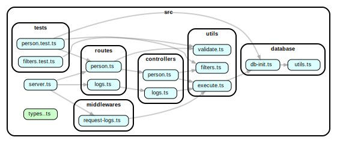

# GlobalThinkTech Backend Challenge

## Resumen

El proyecto que se presenta tiene como objetivo central mostrar parte de mis conocimientos en los temas centrales propuestos por la prueba técnica: **API REST**, **manipulación de datos** y **manejo de errores** utilizando las tecnologías de **Typescript** y **Node.js**. Para esto, se construyo una **API REST** con las operaciones **CRUD** utilizando las tecnologías mencionadas (entre otras) que interactúa con una **Base de datos SQLite** instanciada en *memoria*. 

## API

La API proporciona las siguientes rutas:

- `GET /api/persons`: Obtiene una lista de todas las personas.
- `POST /api/persons`: Crea una nueva persona.
- `GET /api/persons/:id`: Obtiene los detalles de una persona específica.
- `PUT /api/persons/:id`: Actualiza los detalles de una persona específica.
- `DELETE /api/persons/:id`: Elimina una persona específica.
- `GET /api/logs`: Obtiene el registro de operaciones realizadas en la api.

## Inicio rápido 

### Requisitos previos

- Node.js
- yarn

### Instrucciones

1. Clona el repositorio de *GIT* ejecutando alguno de los dos comandos:
   > `git clone https://github.com/PelePeluche/GlobalThinkTech.git`
   > `git clone git@github.com:PelePeluche/GlobalThinkTech.git`

2. Dentro del repositorio, instala las dependencias necesarias:
   > `yarn`

3. Compila el proyecto:
   > `yarn tsc`

4. Inicia el servidor:
   > `yarn start`

Con esto, el server estará disponible en `localhost:3000`.

Además, es posible levantar el server para modo development con:

> `yarn dev`

## Ejemplos de uso

Al iniciar el servidor, este se conecta a una *base de datos* alojada en memoria que a su vez es cargada con datos generados con la librería **faker.js** que permite probar la funcionalidad de la **API**.

Así, 

> `localhost:3000/api/person`

devuelve la lista de personas creadas al iniciar la *base de datos* (unas 50 por defecto).

Luego,

> `localhost:3000/api/person?fields=first_name,bio,lucky_number`

devuelve solo los campos first_name, bio y lucky_number de cada persona. **Nota**: *estos filtros manifiestan unas de las funcionalidades requeridas en el challenge*

Otra funcionalidad se puede obtener con

> `localhost:3000/api/person?pageSize=20&page=2`

en donde se paginan los resultados de los *GET* anteriores. 

Además es posible hacer uso del resto de las operaciones **CRUD** para el recurso *`person`*

También se puede acceder (y con paginación) al registro de interacciones del usuario  con la *API* mediante 

> `localhost:3000/api/logs`

## Test

Para ejecutar **suit de tests** hay que ejecutar el comando:

> `yarn test`

## Explicación del proyecto

El objetivo de este apartado es dar a conocer el motivo de algunas las decisiones tomadas en la elavoración del pryecto.

### Base de datos con SQLite

Dado que en los requerimientos no se especificaba, consideré la posibilidad de que la *API* creada interactuase con una *API* externa en lugar de crear una *base de datos* propia. Aun así, teniendo en cuenta que el manejo de una *base de datos* es una de las tareas requeridas a un *desarrollador backend*, me pareció que era mejor decisión utilizar una *base de datos* local. De esta manera, aunque las posiblidades que ofrece **SQLite** son limitadas, decidí usar SQLite debido a su simplicidad, facilidad de configuración y posibilidad de alojarla en memoria. 

### Estructura del proyecto

Las decisiones tomadas respecto a la estructura de carpetas del proyecto se basan principalmente en la suposición de que este podría escalar a mayores magnitudes. En el esquema anterior (generado con la librería `Dependency cruiser`) se puede observar la dirección de las dependencias de los archivos del proyecto.

Este diagrama es un indicativo de una buena ***modularización*** del proyecto. Cada módulo tiene responsabilidades claramente definidas y existe una mínima dependencia entre ellos. Esto significa que se pueden añadir, modificar o eliminar funcionalidades con un impacto mínimo en el resto del sistema.

Por ejemplo, se puede ver que (exceptuando por los tests), el único módulo que hace uso de la *base de datos* es ***`execute.ts`***. Esto significa que cualquier cambio en el módulo **Database** tendrá un impacto controlado en el resto del proyecto, ya que no hay otros módulos que dependan directamente de él.

### Tests

Si bien la cobertura de tests no es completa, me pareció suficiente por dos motivos:
1. Ayuda a entender mis conocimientos sobre testing unitario
2. Las funciones principales de la *API* se encuentran cubiertas, de modo que los tests resultaron funcionales para el desarrollo del proyecto. Es decir, los casos de test creados me sirvieron para 'checkear' el estado de la *API* durante el desarrollo

### Implementación del middlware requerido

Me pareció razonable que el middlware registre, en la *base de datos*, todas las interacciones del usuario con la *API* exceptuando aquellas que se hagan con la ruta utilizada para acceder a los registros tomados. Si la *API* manejara más rutas, dada la implementación de la función que realiza el registro y el lugar en donde se instancia el middlware, estas interacciones también serían tenidas en cuenta.

### Manipulación de datos

La función que se pide de implementar para la *manipulación de datos*, se usa en el proyecto con el objetivo de que a las consultas a través del método GET al recurso `person` se les puedan filtrar los campos. Si bien esto no estaba aclarado en los requerimientos, considero que la supoción de que esa era su funcionalidad no es muy atrevida.

## Cierre

Espero que el proyecto sea de su agrado y cualquier crítica o consulta es bienvenida. 

Abrazo!

